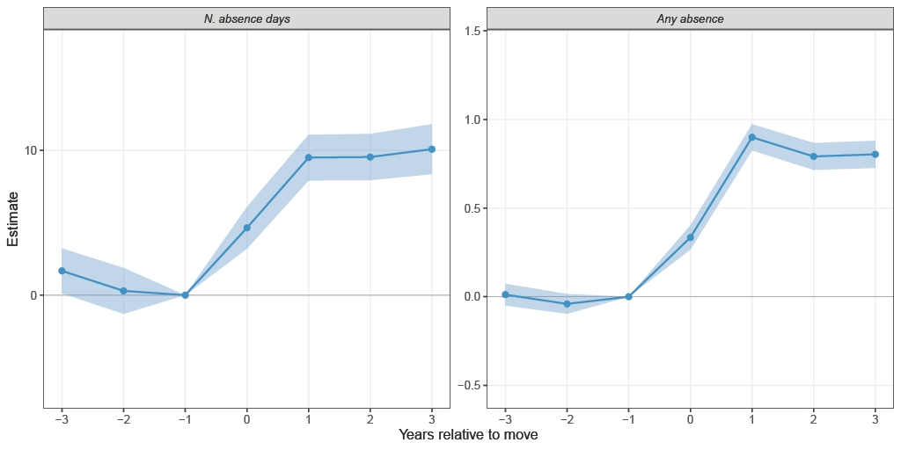

```{=html}
<div class="content-page">

<div class="page-header fade-in">
  <h1 class="page-title">Job Market</h1>
  <div class="page-line" style="width:50px;height:3px;background:#d4a039;margin:0 auto;border-radius:2px;"></div>
</div>

<!-- JMP: paper + figures side by side -->
<div class="fade-in" style="display:flex;flex-wrap:wrap;gap:2rem;align-items:flex-start;margin-bottom:2rem;">

  <!-- Left: paper card -->
  <div class="pub-card" style="flex:1;min-width:280px;border-left:4px solid #d4a039;padding-left:1.2rem;">
    <div style="display:inline-block;background:#d4a039;color:#fff;font-size:0.72rem;font-weight:700;letter-spacing:0.05em;padding:0.15rem 0.5rem;border-radius:3px;margin-bottom:0.5rem;text-transform:uppercase;">Job Market Paper</div>
    <div class="pub-title">Well-being salience in corporate disclosures and worker health</div>
    <div class="pub-authors">Di Francesco, R., Hull, P. &amp; Menon, S.</div>
    <p style="margin-top:0.8rem;">We study how firms' orientation toward employee well-being shapes the health of their workers. Because this orientation is not directly observable, we measure it from the language Danish firms use in their public disclosures, applying language models to construct a firm-level <em>well-being salience score</em>. We link this score to population-wide administrative registers of health and work absence over 2013&ndash;2022, and exploit workers' mobility between firms to estimate how worker health responds to a change in the salience of their employer. We find an asymmetry: workers who move to higher-salience firms take substantially more sickness absence, while their use of mental-health care does not change. Because worsening health would raise both, the absence response reflects behavior rather than deteriorating health. Our results show that firms shape not only worker health but how workers act on it, and that the language of routine corporate disclosure can be read for economically meaningful features of the workplace that administrative data leave unrecorded.</p>
  </div>

  <!-- Right: figures stacked -->
  <div style="flex:0 0 380px;min-width:280px;display:flex;flex-direction:column;gap:1.5rem;">
    <figure style="margin:0;">
      
      <figcaption style="font-size:0.8rem;color:#666;margin-top:0.4rem;">Well-being language in Danish corporate annual reports. Firms using this vocabulary more intensively receive a higher salience score.</figcaption>
    </figure>
    <figure style="margin:0;">
      
      <figcaption style="font-size:0.8rem;color:#666;margin-top:0.4rem;">Workers moving to higher-salience firms take significantly more sickness absence from the year of the move. Pre-trends are flat. The effect on mental-health-care use is near zero, pointing to a behavioral channel.</figcaption>
    </figure>
  </div>

</div>

<h2 class="section-label fade-in">Materials</h2>

<div class="fade-in" style="display:flex;flex-wrap:wrap;gap:0.75rem;margin-bottom:2.5rem;">
  <a class="btn btn-paper" href="assets/others/cv.pdf" download>Download CV</a>
</div>

</div>

```
